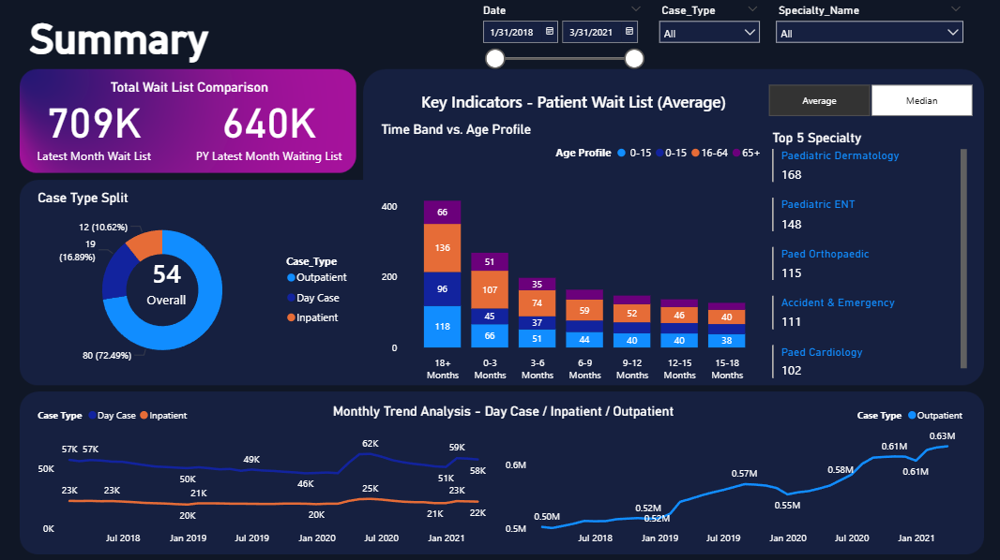
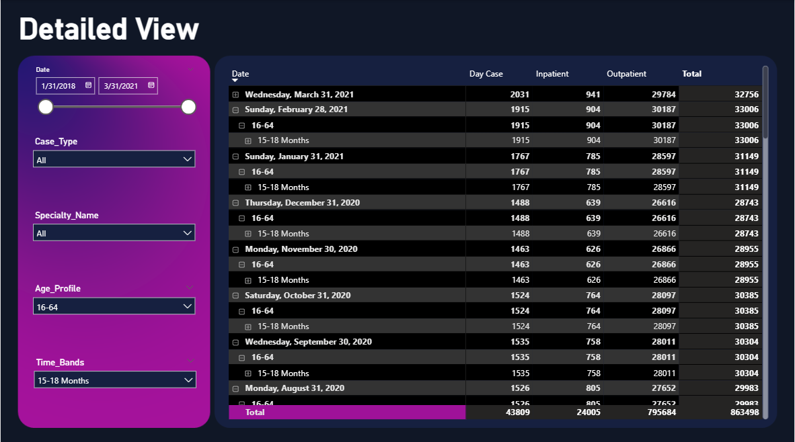

# Waiting List Analytics Dashboard – Power BI Project

## Project Overview
The **Waiting List Dashboard** is an interactive Power BI solution designed to analyze patient waiting list in a healthcare setting.

The dashboard provides visibility into current waiting list status, historical monthly trends, and detailed specialty and demographic breakdowns. It combines strong analytical capabilities with advanced interactivity and design experimentation.

##  Report Structure

### Page 1 – Waitlist Summary

### Page 2 – Detailed View

---

## Project Objectives
This dashboard was built to:

- Track the current status of patient waiting lists
- Analyze historical monthly trends
- Compare Inpatient vs Outpatient categories
- Perform specialty-level analysis
- Examine age profile distribution
- Enable interactive drilldown exploration

The goal is to support healthcare administrators in identifying demand patterns, capacity pressures, and operational bottlenecks.

---

##  Core Capabilities

###  Current Status Monitoring
- Total patients on waiting list
- Inpatient vs Outpatient distribution
- Specialty-level breakdown
- Age group segmentation

###  Time Intelligence & Trend Analysis
- Monthly waiting list trend analysis
- Historical comparison across periods
- Category trend comparison (Inpatient vs Outpatient)
- Time-based filtering and dynamic date selection

###  Advanced Interactivity
- Drilldown capabilities 
- Interactive slicers (date, category, specialty)
- Dynamic visual filtering
- Cross-highlighting across visuals

---

## Tools & Technical Skills Demonstrated

- Power BI Desktop
- Power Query (data cleaning & transformation)
- Data modeling
- DAX measures
- Time intelligence functions
- Interactive report design
- UX-focused layout structuring

---

##  Design Approach

This project intentionally explores a more colorful and visually dynamic design style.

While traditional healthcare dashboards may follow a more conservative visual theme, this design was developed to:

- Test visual storytelling capabilities
- Experiment with color balance and contrast
- Explore creative dashboard aesthetics

---

## Business Value

This dashboard enables decision-makers to:

- Monitor real-time waiting list pressure
- Identify high-demand specialties
- Detect upward or downward trends
- Support capacity planning decisions
- Improve data-driven healthcare management

---

##  Key Skills Demonstrated

- Healthcare data analysis
- Time-series analysis
- Advanced interactivity & drilldown implementation
- DAX-based calculations
- Business storytelling with data
